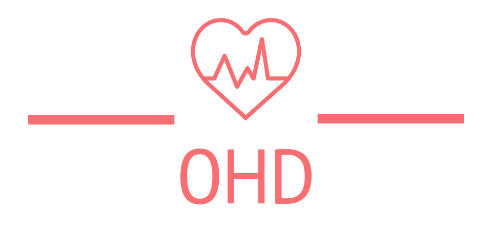

# Onsite Health Diagnostic (OHD)

             Onsite Health Diagnostic (OHD) is the web application that allows users to predict whether the user has been infected with a menacing disease or not.
These diseases can be very dangerous to health if they are not treated properly.
The main objective of OHD is to help people predict the disease in case of absence of medical professionals, strikes or any related uncertainties.

 

The Machine learning algorithm deployed along with the website will diagnose the disease as accurately as possible. Nevertheless, the project is based on educational purposes and we will not be responsible in any possible way if the model predicts false results because the ML model can’t be correct 100% all the time either. So, we urge users to try it at your own risk.

### Disease Description

 The mentioned disease will be diagnosed by the predictive model in the project

- Heart Failure Prediction
- Breast Cancer Prediction
- Diabetes Prediction
- Thyroid Prediction
- Brain Tumor prediction
- Pneumonia Prediction
- Malaria Prediction

### Why Onsite Health Diagnostic (OHD)

The main objective of OHD is to aid individuals, medical professionals or any learners to help diagnose disease based on the data. For example , if you want to diagnose a brain tumor , you only need to upload the IR image of your brain. If you want to know if you have suffered from heart disease, you only need to input some data such as BMI, Age, Cholesterol, RestingECG etc. The Machine Learning model integrated with websites helps predict whether you have got a certain disease or not.

### Licence

 The project [OHD](https://github.com/Nix-code/Onsite-Health-Diagnostic-OHD) is licenced under [MIT Licence](https://github.com/Nix-code/Onsite-Health-Diagnostic-OHD/blob/main/LICENSE) 